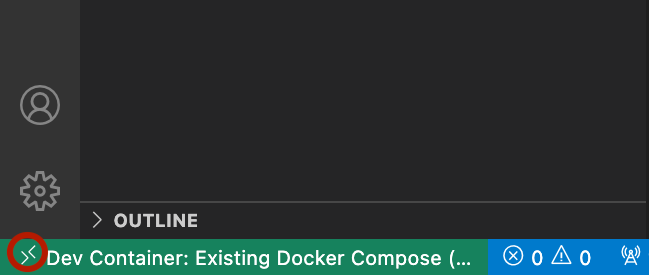

# Docker + VSCode + Remote-Container機能拡張 によるSphinxマニュアル開発環境の構築

## 1. 前提条件

ローカルPCに以下がインストールされていること。

1. Docker
1. VSCode
1. VSCode機能拡張: Remote - Containers
1. VSCode機能拡張: reStructuredText

## 2. ローカルPC上の環境構築

以下の手順では、"sphinx"という空のフォルダを作成し、そこに環境をセットアップする。環境構築には Sphinx の(ほぼ)Docker公式イメージである "sphinxdoc/sphinx" を使用し、そこから環境初期設定ツール`quickstart`を実行する。

```bash
# sphinxフォルダを作成
$ mkdir sphinx

# 環境の初期化
$ docker run -it --rm -v `pwd`:/docs sphinxdoc/sphinx:4.0.2 \
  sphinx-quickstart --sep -p demo1 -a tmj -v 0.1 -r 0.1 -l ja

# 実行結果
$ tree .
.
├── Dockerfile
├── Makefile
├── README.md
├── build
├── docker-compose.yml
├── make.bat
├── projectinfo.env
└── source
    ├── _static
    ├── _templates
    ├── conf.py
    └── index.rst

# ビルドが正しくできるか確認
$ docker run --rm -v `pwd`:/docs sphinxdoc/sphinx:4.0.2 make html
$ open build/html/index.html  # Webブラウザで画面を見て確認
```

## 3. 開発環境のコンテナ化

### 3.1 Dockerfile の作成

Read the Docs テーマをプレインストールした Dockerfileを以下の通り作成。

```Dockerfile
FROM sphinxdoc/sphinx:4.0.2

# Install Read the Docs theme (https://sphinx-rtd-theme.readthedocs.io/en/stable/)
RUN pip install sphinx-rtd-theme
```

### 3.2 Docker Compose ファイルの作成

Docker Compose ファイルの作成は必須ではないが、あると Remote - Containers 機能拡張を使わないで開発するときにdocker コマンドの細かい引数を覚えなくてもいいので一応作っておく。

```Docker-Compose
version: '3.8'

services:
  sphinx:
    image: tmj-sphinx:0.1
    build:
      context: .
      dockerfile: Dockerfile
    volumes:
      - .:/docs
```

### 3.3 イメージのビルドとテーマの確認

Dockerイメージをビルドし、Read the Docsテーマがきちんと動作することを確認。

```bash
# イメージのビルド
$ docker-compose build

# Read the Docs テーマの設定 (see https://sphinx-rtd-theme.readthedocs.io/en/stable/)
$ vi source/conf.py # extensionsに "sphinx_rtd_theme" を追加 etc.

# ビルドしてテーマが適用されているか確認
$ docker run --rm -v `pwd`:/docs tmj-sphinx:0.1 make html
$ open build/html/index.html  # Webブラウザで画面を見て確認
```

### 3.4 Remote - Containers から起動

以下の手順でVSCodeのRemote-Containersから起動する。

#### (1) VSCode で sphixフォルダを開く

```bash
# sphinx フォルダでVSCodeを起動
$ code .
```

#### (2) 起動後、ウィンドウ左下隅のアイコンをクリック




#### (3) コマンドパレットから "Reopen in Container" を選択


これでコンテナ内でSphinxを開くことができました。

### 3.5 ビルドの実行確認

VSCodeのTerminalを開くと、最初から "/docs" フォルダが開かれます。ビルドするには、`make html` を実行します。正しくビルドできたら成功です。"build/html/index.html"ファイルが出力されるので、それをブラウザで開くと正しくビルドできていることが確認できます。
