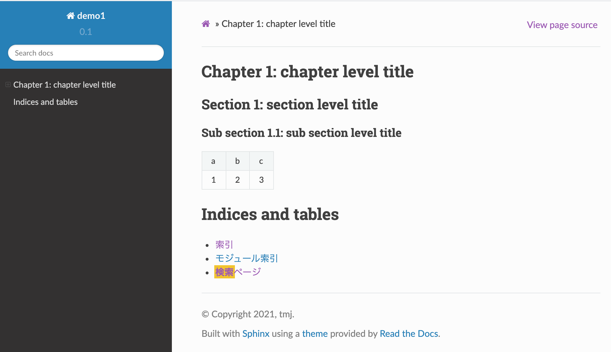
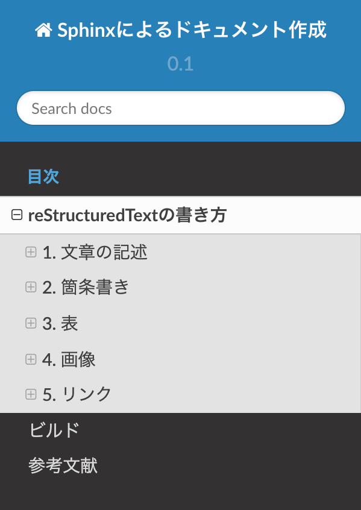

=============================================
reStructuredTextの書き方
=============================================

Sphinxでドキュメントを作成するには、reStructuredText と呼ばれるマークアップ言語で文書を記述します。本文書では、reStructuredText の書き方について解説します。

1. 文章の記述
=================================

.. index::
  single: Title
  single: タイトル

(1) タイトル
-------------------

以下のように``===``で上下で囲みます(見出しの長さ以上の長さが必要です)。文法的には``=``ではなく``#``など他の記号文字でも良いのですが、記述ルールとしては``=``にしておいたほうがよいでしょう。

※ reStructured Text (reST) の文法はここに限らず全体的にかなり自由度があり、同じ結果を得るのにいろいろな書き方が可能です。
ただ随時異なる書き方をしても意味はないので、本文書では reST の仕様そのものではなく、ある程度一般的な書法に決め打ちして説明します。

::

  ==========================================
  SphinxによるreStructuredTextの書き方
  ==========================================

.. index::
  single: Header
  single: 見出し

(2) 見出し (章、節、小節)
---------------------------------

レベル1からレベル3 (章、節、小節) までの見出しは、それぞれ異なる記号文字でアンダーラインを引きます。

::

  章見出し (レベル1)
  =======================

  節見出し (レベル2)
  -------------------

  小節見出し (レベル3)
  ~~~~~~~~~~~~~~~~~~~~~~~

レベル4以上の見出しを使う場合は (最大6レベル)、さらに別の記号文字でアンダーラインを引きます (それまでのレベルでまだ使ってない記号文字であれば何でも可)。

.. index::
  single: Paragraph
  single: 段落
  single: Indent
  single: インデント

(3) 段落、インデント
---------------------------------

行頭からいきなり文を書き始めればそのまま本文になります。
改行は半角スペースと同じ扱いになります。明示的に改行したいとき、つまり段落を新たに起こしたいときは空行を1行入れます。
実際には2行以上入れても良いのですが、文章作成ルールとしては常に1行にしておいたほうが無難です。

段落をまるごとインデントしたいときは、単にインデントして書き始めればよいだけです。インデント幅は自由ですが、半角スペース2つが良いでしょう。

::

    これはインデントした文章の例です。
  (↑行頭にスペースが2つ入っています)

上記の表示結果はこのとおり。

  これはインデントした文章の例です。

(4) 整形済みテキスト(<pre>)
---------------------------------

HTMLの<pre>のように記号や改行を解釈なしでそのまま反映したいときは行頭に :: を書き、空行を1行空けたあとにインデントして書きます。
"タイトル::"のように書くと、タイトルを入れられます。

::

  整形済みテキストの例::

    *などの記号や改行などが
    そのまま維持されます。

整形済みテキストの例::

  *などの記号や改行などが
  そのまま維持されます。

(5) コードブロック
---------------------------------

ソースコードの例を載せるときは、".. sourcecode" ディレクティブを使います。":linenos:"オプションを使うと行番号を入れられます。

::

  .. sourcecode:: javascript
    :linenos:
    :caption: ES6 code example

    const foo = bar();
    const baz = foo;

上記の表示結果はこのとおり。

.. sourcecode:: javascript
  :linenos:
  :caption: ES6 code example

  const foo = bar();
  const baz = foo;

(6) NoteとWarning
---------------------------------

文章中に注記や警告を書けます。

::

  .. note::

    これはノートです。

  .. warning::

    これは警告です。

上記の表示結果はこのとおり。

.. note::

  これはノートです。

.. warning::

  これは警告です。
    
(7) 文字装飾、エスケープ
---------------------------------

**文字装飾**

+ \*\*太字\*\* と書くと太字 (bold) になります。
+ \*\*italic\*\* と書くと斜体 (italic) になります。

**エスケープ**

+ \* などの記号をSphinxに解釈されないようにエスケープするには \\\* のように \\ でエスケープします。
+ \`\`\*\`\` のように2重のバックスラッシュで囲む方法もありますが、こちらは色が変わります。
  例) \`\`\*\`\` → ``*``

2. 箇条書き
=================================

(1) 番号付きリスト
---------------------------------

``1.``, ``2.``, .. のように "番号+.(ピリオド)" の形式で書きます。Markdownと違って1から連番にしないと
正しくビルドされません。

リスト項目はそれぞれが一つの段落なので空行を入れてから開始し、次のリスト項目との間にも空行を入れます。
リスト項目自体は複数行テキストとして書けます。その場合、2行目を空行とし、3行目以降はインデントします。

::

  1. リスト1
  
    リスト1の内容はこちら。
  
    複数段落もOK。 
  
  2. リスト2
  
  3. リスト3

上記の表示結果はこのとおり。

1. リスト1

  リスト1の内容はこちら。

  複数段落もOK。 

2. リスト2

3. リスト3

(2) 番号なしリスト
---------------------------------

番号なしリストは``+``、``-``、``*`` のいずれかを先頭につけます。どれでもよいのですが、入れ子にもできるので
``+``、``-``、``*`` の順に使っていくと良いでしょう。

::

  + リスト1
  
  + リスト2
  
    - リスト2.1
  
    - リスト2.2
    
  + リスト3

上記の表示結果はこのとおり。

+ リスト1

+ リスト2

  - リスト2.1

  - リスト2.2
  
+ リスト3

(3) 定義リスト
---------------------------------

定義リストは用語の定義に使うと便利です。用語を行頭に1行で書き、(空行を空けずに)次行に説明を書きます。

::

  用語1
    定義の説明・・・・・・

上記の表示結果はこのとおり。

用語1
  定義の説明・・・・・・

.. _chapter-3-table:

3. 表
=================================

テーブルはいくつかの方法で作れますが、CSVテーブルかリストテーブルが書きやすそうです。

詳しくは公式ページ: https://www.sphinx-doc.org/ja/master/usage/restructuredtext/basics.html#tables

(1) CSVテーブル
---------------------------------

".. csv-table" ディレクティブを使います。

::

  .. csv-table::
  
     a,b,c
     1,2,3

上記の表示結果はこのとおり。

.. csv-table:: Languages
  :header: TypeScript, ES6, ES5
  :widths: 15, 10, 10

   const, const, var
   let, let, var

(2) リストテーブル
---------------------------------

".. list-table" ディレクティブを使います。CSVテーブルとやれることは同じですが、リスト形式で書けます。

::

  .. list-table:: Languages
    :header-rows: 1
    :widths: 15, 10, 10
  
    * - TypeScript
      - ES6
      - ES5
    * - const
      - const
      - var
    * - let
      - let
      - var

上記の表示結果はこのとおり。

.. list-table:: Languages
  :header-rows: 1
  :widths: 15, 10, 10

  * - TypeScript
    - ES6
    - ES5
  * - const
    - const
    - var
  * - let
    - let
    - var

(3) グリッドテーブル
---------------------------------

下記のように自分で罫線を引きます。

::

  +--+--+--+
  | TypeScript | ES6   | ES5 |
  +==+==+==+
  | const | const | var |
  +--+--+--+
  | let | let   | var |
  +--+--+--+

上記の表示結果はこのとおり。

+------------+-------+-----+
| TypeScript | ES6   | ES5 |
+============+=======+=====+
| const      | const | var |
+------------+-------+-----+
| let        | let   | var |
+------------+-------+-----+

(4) シンプルテーブル
---------------------------------

グリッドテーブルをより簡潔に書ける書き方ですが、列区切りの位置を合わせる必要があるので逆に面倒かもしれません。また、セル内に複数行のテキストが設定できません。

::

  ==========  ======  =======
  TypeScript  ES6     ES5
  ==========  ======  =======
  const       const   var
  let         let     var
  ==========  ======  =======

上記の表示結果はこのとおり。

==========  ======  =======
TypeScript  ES6     ES5
==========  ======  =======
const       const   var
let         let     var
==========  ======  =======

.. _figure_numbering:

(5) 図表番号
---------------------------------

conf.py に `numfig = True` と書くと、図表番号が自動で入ります。番号付けされるのは以下です (キャプションに対して付けられるので、キャプションが設定できないシンプルテーブルや画像 (image) は対象外)。

* CSVテーブル
* リストテーブル
* 図 (figure)
* コードブロック (sourcecode)

4. 画像
=================================

(1) 画像 (image)
-------------------------------------

画像を埋め込むには ".. image" ディレクティブを使います。 ":width" と ":height" オプションを使うとサイズが指定できます。
":scale" オプションに % で縮尺を指定できます。

::

   .. image:: path/to/image.png (ソースファイルからの相対パス。"/"で始めるとソースディレクトリからのパスになる)
     :scale: 50%
     :width: 200px (px,em,ex,in,cm,mm,pt,pc が使える)
     :height: 100px 

* 詳しい解説は公式ページを見てください: https://www.sphinx-doc.org/ja/master/usage/restructuredtext/basics.html#images

::

  .. image:: images/image1.png
  
上記の表示結果はこのとおり。

(2) 図 (figure)
-------------------------------------

画像と同じですが、キャプションを入れられます。

::

  .. figure:: images/image1.png
    :align: center

    これは図です。

上記の表示結果はこのとおり。

  これは図です。

(3) 図表番号
---------------------------------

:ref:`figure_numbering` を参照。

5. リンク
=================================

(1) ハイパーリンク (URL)
-------------------------------------

単純にURLを書けばそのままリンクになります。テキストにリンクを設定したいときは、`テキスト <url>`_ のように書きます。
後者の形式では最初にテキストだけ記述し、別の箇所にURLを書くこともできます (複数箇所で同一のURLを設定したいときに使う)。

::

  * https://www.google.com
  * `Googleへのリンク <https://www.google.com>`_
  * `Googleへのリンク2`_

  .. _Googleへのリンク2: https://www.google.com

上記の表示結果はこのとおり。

* https://www.google.com
* `Googleへのリンク <https://www.google.com>`_
* `Googleへのリンク2`_

.. _Googleへのリンク2: https://www.google.com

(2) ハイパーリンク (ページ内リンク)
-------------------------------------

章や節にリンクを貼りたいときは、".. _label-1:" のように飛び先の章や節の直前にラベルを設定し、":ref: label-1" のように ":ref:" で参照します。ラベル設定時は先頭に "_" をつけ、ラベル参照時には "_" を付けないことに注意。

::

  .. _chapter-3-table:

  3. 表
  =================================

  表については :ref:`chapter-3-table` を参照してください。

上記の表示結果はこのとおり。

表については :ref:`chapter-3-table` を参照してください。

(3) 他のページへのリンク
---------------------------------

他のページのリンクは ":doc:\`ファイル名\`" を使います。ファイル名の拡張子は省略できます。

::

  ビルドに関しては :doc:`build` を参照してください。

上記の表示結果はこのとおり。

ビルドに関しては :doc:`build` を参照してください。

6. ページの構成と目次
=================================

(1) マスタードキュメント
---------------------------------

source フォルダの index.rst はマスタードキュメントと呼ばれ、すべてのページのルートとなります。
このページは全体のトップページであり、目次を保持します。初期状態 (=quickstartを実行した直後の状態) ではマスタードキュメントしかありません。

(2) ページの追加
---------------------------------

ページを追加するには、source フォルダに任意のファイルを追加し、目次にそのページを追加するだけです。
たとえば、"contents.rst" というファイルを追加し、目次にこのファイルを登録します。

(3) 目次
---------------------------------

目次は ".. toctree:" ディレクティブで記述します。

::

  .. toctree::
   :maxdepth: 2
   :caption: 目次

   rest
   build
   reference

上記は、rest.rst、build.rst、reference.rst という3つのファイルがあるときの例です。
目次の見出しが "目次"、目次の階層レベルは 2 です。以下のように表示されます。

  目次の例

7. その他
=================================

(1) コメント
---------------------------------

ソースファイルにコメントを書きたいときは、".. ここはコメント" のように、".. " に続けて直接テキストを入れます。
コメントは画面に表示されません。

(2) Todoリスト
---------------------------------

".. todo::" ディレクティブを使うと、書きかけの項目をマークしておくことができます。

::

  .. todo:: あとで書く

これは以下のように表示されます。

.. todo:: あとで書く

(3) Font Awesome アイコン
---------------------------------

Font Awesome のアイコンが使えます。

::

  .. fa:: check
  
  * checkアイコン: :fa:`check`
  
  * check lg アイコン: :fa:`check lg`
  
  * square-o アイコン: :fa:`square-o`

これは以下のように表示されます。

.. fa:: check

* checkアイコン: :fa:`check`

* check lg アイコン: :fa:`check lg`

* square-o アイコン: :fa:`square-o`
