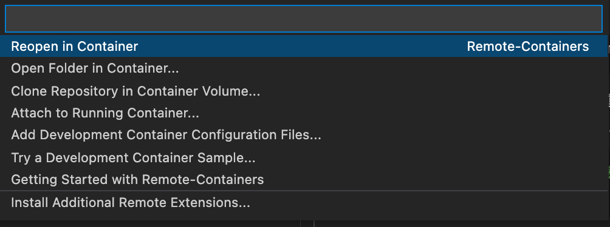

===============================================================
マニュアル開発環境の構築
===============================================================

Docker + VSCode + Remote-Container機能拡張 による Sphinx マニュアル開発環境の構築方法について説明します。

1. 前提条件
=================================

ローカルPCに以下がインストールされていること。

1. Docker
2. VSCode
3. VSCode機能拡張: Remote - Containers
4. VSCode機能拡張: reStructuredText

2. ローカルPC上の環境構築
=================================

環境構築は Sphinx の(ほぼ)Docker公式イメージである "sphinxdoc/sphinx" を使用し、そこからセットアップツールの`quickstart`を実行して初期開発環境を作成します。

.. sourcecode:: bash

  # 空のフォルダを作成
  $ mkdir sphinx
  
  # quickstart を使って環境を初期化
  #  --sep: ソースコードをsourceフォルダ、ビルド結果をbuildフォルダに分ける
  #  -p <project name>: プロジェクト名
  #  -a <author>: 著者
  #  -v <version> -r <release>: バージョン番号とリリース番号
  #  -l <lang>: en/ja/zh_CN
  $ docker run -it --rm -v `pwd`:/docs sphinxdoc/sphinx:4.0.2 \
    sphinx-quickstart --sep -p phinx-devcontainer-howto -a tmj -v 0.1 -r 0.1 -l ja
  
  # 実行結果 (以下のフォルダ構成が作成される)
  $ tree .
  .
  ├── Dockerfile
  ├── Makefile
  ├── README.md
  ├── build
  ├── docker-compose.yml
  ├── make.bat
  ├── projectinfo.env
  └── source
      ├── _static
      ├── _templates
      ├── conf.py
      └── index.rst
  
  # ビルドが正しくできるか確認
  $ docker run --rm -v `pwd`:/docs sphinxdoc/sphinx:4.0.2 make html
  $ open build/html/index.html  # Webブラウザで画面を見て確認

3. 開発環境のコンテナ化
=================================

3.1 Dockerfile の作成
---------------------------------

Read the Docs テーマをプレインストールした Dockerfileを以下の通り作成しプロジェクトのルートフォルダに置きます。

.. sourcecode:: Dockerfile

  FROM sphinxdoc/sphinx:4.0.2

  #
  # Debian packages
  #

  # Components required for building PDF documents
  RUN apt-get update && \
      apt-get install -y latexmk && \
      apt-get install -y texlive-lang-cjk && \
      apt-get install -y texlive-formats-extra

  #
  # Sphinx Extensions
  #

  # Read the Docs theme (https://sphinx-rtd-theme.readthedocs.io/en/stable/)
  RUN pip install sphinx-rtd-theme

  # i18n support
  RUN pip install sphinx-intl

  # fontawesome
  RUN pip install sphinx_fontawesome

  # autobuild
  RUN pip install sphinx-autobuild

  # trim redandunt space in Japanese text.
  RUN pip install sphinxcontrib-trimblank

  # blockdiag extensions
  RUN pip install sphinxcontrib-blockdiag \
                  sphinxcontrib-seqdiag \
                  sphinxcontrib-actdiag \
                  sphinxcontrib-nwdiag

  # tseg search for better Japanese search
  #   and a patch for tseg search for python 4 (https://github.com/whosaysni/sphinx-tsegsearch/pull/3)
  RUN pip install sphinx-tsegsearch==1.0 \
      && cd /usr/local/lib/python3.9/site-packages/sphinx_tsegsearch/ \
      && mv __init__.py __init__.py.org \
      && cat __init__.py.org | sed -e 's/add_javascript/add_js_file/' > __init__.py \
      && rm __init__.py.org

3.2 Docker Compose ファイルの作成
---------------------------------

Docker Compose ファイルの作成は必須ではないありませんが、あると docker コマンドの細かい引数を覚えなくてもいいので一応作っておきます。

.. sourcecode::

  version: '3.8'
  
  services:
    sphinx:
      image: sphinx-devcontainer-howto:0.1
      build:
        context: .
        dockerfile: Dockerfile
      volumes:
        - .:/docs

3.3 イメージのビルドとテーマの確認
---------------------------------------

Dockerイメージをビルドし、Read the Docsテーマがきちんと動作することを確認。

.. sourcecode:: bash

  # イメージのビルド
  $ docker-compose build
  
  # Read the Docs テーマの設定 (see https://sphinx-rtd-theme.readthedocs.io/en/stable/)
  $ vi source/conf.py # extensionsに "sphinx_rtd_theme" を追加 etc.
  
  # ビルドしてテーマが適用されているか確認
  $ docker run --rm -v `pwd`:/docs tmj-sphinx:0.1 make html
  $ open build/html/index.html  # Webブラウザで画面を見て確認

3.4 Remote - Containers から起動
---------------------------------------

以下の手順でVSCodeのRemote-Containersから起動します。

(1) VSCode で sphixフォルダを開く
~~~~~~~~~~~~~~~~~~~~~~~~~~~~~~~~~~~

.. sourcecode:: bash

  # sphinx フォルダでVSCodeを起動
  $ code .

(2) 起動後、ウィンドウ左下隅のアイコンをクリック
~~~~~~~~~~~~~~~~~~~~~~~~~~~~~~~~~~~~~~~~~~~~~~~~~~~~~~~

.. image:: images/rc-icon.png
   :scale: 70%

(3) コマンドパレットから "Reopen in Container" を選択
~~~~~~~~~~~~~~~~~~~~~~~~~~~~~~~~~~~~~~~~~~~~~~~~~~~~~~~

これでコンテナ内でSphinxを開かれます。

3.5 ビルドの実行確認
---------------------------------------

VSCodeのTerminalを開くと、最初から "/docs" フォルダが開かれます。ビルドするには、`make html` を実行します。正しくビルドできたら成功です。"build/html/index.html"ファイルが出力されるので、それをブラウザで開くと正しくビルドできていることが確認できます。
